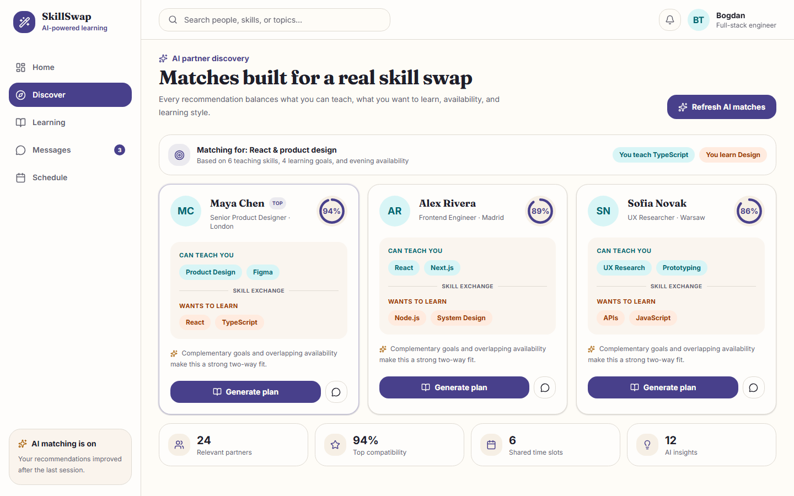
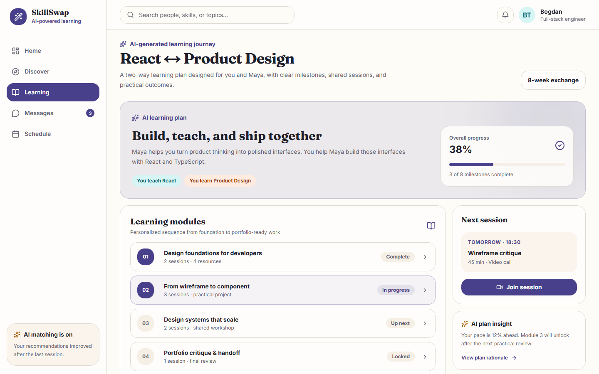
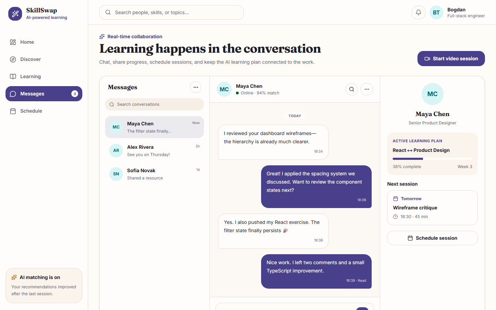

# SkillSwapAI 🚀

**AI-powered platform for skill exchange and finding mentors.**

SkillSwapAI connects people who want to learn with those who want to teach. The system utilizes Artificial Intelligence to analyze user profiles and provide intelligent matchmaking, facilitating real-time communication and learning sessions.


## 🏗 Architecture

The project follows a **microservices-based architecture**, ensuring separation of concerns and scalability.


* **Frontend (Client):** Next.js 16 application for product discovery, learning plans, scheduling, and real-time collaboration.
* **Core Backend (NestJS):** NestJS server handling users, chats, sessions, core business logic, and AI matchmaking/recommendations (via an in-process LangGraph.js + OpenAI integration).
* **External Services:** PostgreSQL (Neon.tech), AWS S3 (Storage), OpenAI API.

## 🛠 Tech Stack

### Frontend
* **Framework:** Next.js 16 (React 19)
* **Language:** TypeScript
* **Styling:** TailwindCSS
* **State Management:** Redux Toolkit
* **Real-time:** Socket.io Client

### Backend (Core)
* **Framework:** NestJS
* **Language:** TypeScript
* **Database ORM:** Prisma
* **Real-time:** Socket.io Gateway
* **AI/ML:** LangGraph.js + OpenAI API integration (LLM), in-process

### Infrastructure & DevOps
* **Containerization:** Docker (for services), Docker Compose (for local orchestration).
* **Database:** PostgreSQL (Cloud-hosted on Neon.tech).
* **Storage:** AWS S3 (via AWS SDK).
* **Deployment:** AWS ECR/ECS pipelines for frontend and backend services.

## Product Experience

| AI partner discovery | Personalized learning plan |
| --- | --- |
|  |  |



## ✨ Key Features

* **🔐 Secure Authentication:** JWT-based registration and login system.
* **🆕 Custom Skill Input:** Users can manually input unique skills during registration if they are not yet in the database. The system automatically indexes these new skills for future AI matching.
* **🤖 AI Matching:** Intelligent prompt algorithm that pairs users based on "Skills to Learn" vs. "Known Skills".
* **🤖 AI Skill Suggestions:** Prompt algorithm that generates 5-4 recommended skills for person to learn.
* **💬 Real-time Chat:** Instant messaging between users powered by WebSockets (Socket.io).
* **📅 Session Scheduling:** Ability to request and schedule learning sessions.
* **🔔 Notification System:** Real-time alerts for new matches,session-creation and messages.

## 🚀 How to Run Locally

### Development (Node / pnpm)

Requires **Node.js 20+** and **pnpm 10.21+** (`corepack enable` or `npm install -g pnpm@10.21.0`).

```bash
# Root tooling (Husky hooks, lint-staged)
pnpm install

# App packages
pnpm --dir frontend install
pnpm --dir backend install
```

Quality checks from the repo root:

```bash
pnpm check          # format:check + lint + types + tests
pnpm format         # Prettier write (frontend + backend)
pnpm lint
pnpm check:types
pnpm test
pnpm knip           # unused exports / dependencies
```

Git hooks: **pre-commit** runs lint-staged (Prettier + ESLint on staged files); **pre-push** runs typecheck and backend unit tests.

### Docker Compose (full stack)

1.  **Clone the repository:**
    ```bash
    git clone https://github.com/3cgbdg/SkillSwapAI.git
    ```

2.  **Configure Environment Variables:**
    Create a `.env` file in the root directory based on the provided `.env.example`.

3.  **Run with Docker Compose:**
    ```bash
    docker-compose up --build
    ```

4.  **Access the application:**
    * Frontend: `http://localhost:3000`
    * Backend API: `http://localhost:4000`

## 👨‍💻 Author

**Bogdan Tytysh**
* Full-Stack Engineer (NestJS, TypeScript, AWS)
* [LinkedIn](https://www.linkedin.com/in/bogdan-tytysh-0b76b1290)
* [GitHub](https://github.com/3cgbdg)
